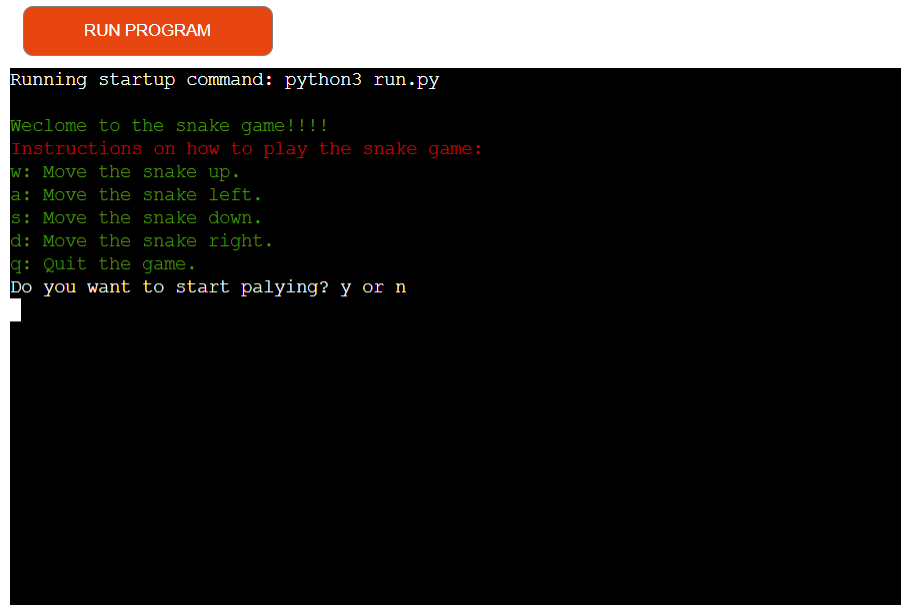
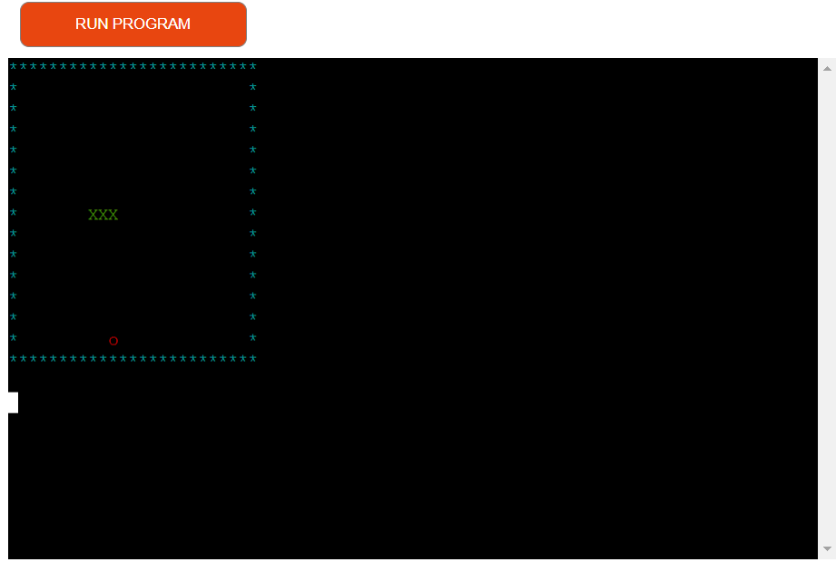
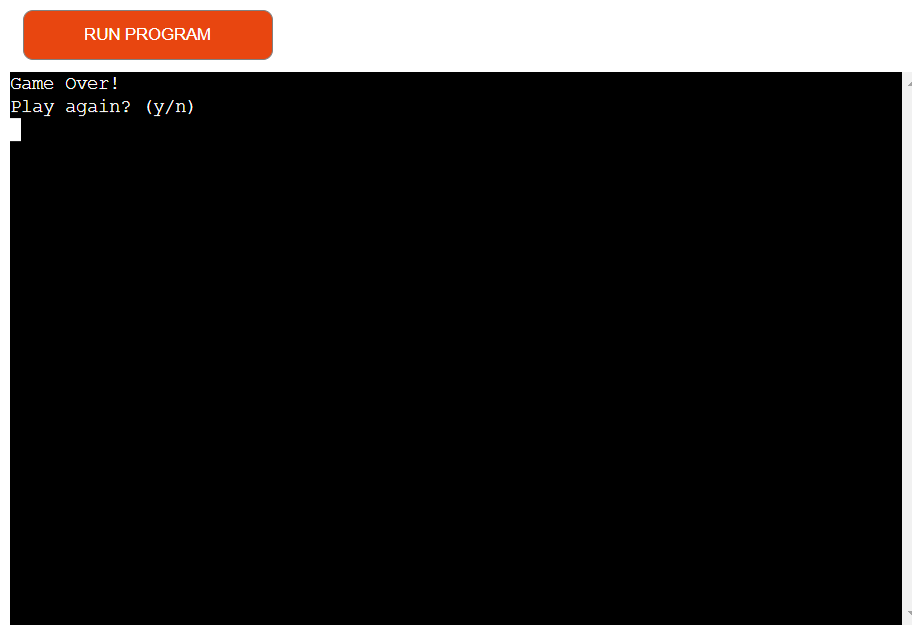
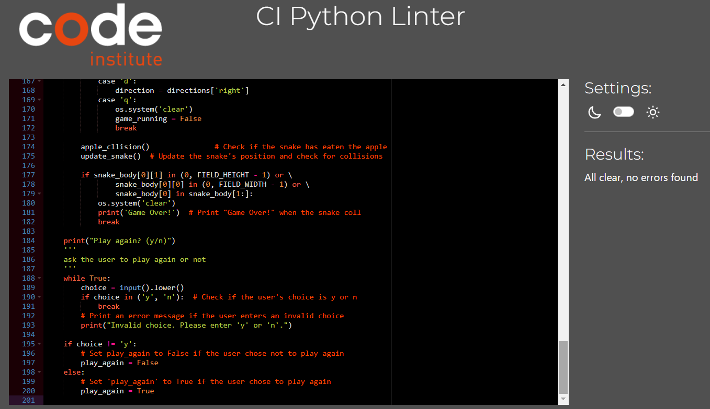

# Snake Game

## Description

[Snake Game](https://snake-game-eabe7ec81bef.herokuapp.com/) is a simple text-based implementation of the classic Snake game. The player controls a snake that moves around the play field to eat apples. The game ends when the snake collides with the boundaries of the play field.

The game is built in Python and uses the `pytimedinput` library for input with a timeout, `colorama` for terminal text color, and `random` for generating random positions.

--------------------------------------------------------------

## Technologies used

-   Python 3.x.
-   pytimedinput.
-   colorama.

--------------------------------------------------------------

## How to Play

1.  Clone the repository or download the source code.

2.  Make sure you have Python 3.x installed on your system.

3.  Install the required libraries using pip:
*   pip install pytimedinput colorama

4.  Run the game:
*  python3 run.py

5.  Use the following keys to control the snake:

*  w: Move the snake up.
*  a: Move the snake left.
*  s: Move the snake down.
*  d: Move the snake right.
*  q: Quit the game.

6.  Try to eat as many apples as possible and avoid hitting the boundaries or the snake's body.

7.  After the game ends, you will be prompted to play again. Enter Y to play again or N to quit the game.

--------------------------------------------------------------

## Features

-  Simple and intuitive controls.
-  Randomly generated apples for added challenge.
-  Color-coded display for snake, apples, and boundaries.
-  Game Over message when the snake collides with the boundaries or itself.

-  Welcoming massage with the instruction about how to play.
   .

-  If user choice 'y' the game will start.
   .

-  If a user lose it will show 'Game Over' and ask if the user wants to play again or not.
   .

--------------------------------------------------------------

## Data Model

  The Snake Game does not use complex data models since it's a simple text-based game. However, it involves some key variables and their purposes:

### Variables

-  `FIELD_WIDTH`: Integer. The width of the play field in cells.
-  `FIELD_HEIGHT`: Integer. The height of the play field in cells.
-  `cells`: List of tuples. Represents all the cells in the play field coordinates.
-  `snake_body`: List of tuples. Contains the coordinates of the snake's body segments.
-  `directions`: Dictionary. Maps the arrow keys to their respective movement directions.
-  `direction`: Tuple. Represents the current direction the snake is moving.
-  `has_eaten`: Boolean. Indicates whether the snake has eaten an apple in the current game loop iteration.
-  `apple_Pos`: Tuple. Represents the coordinates of the apple on the play field.
-  `play_again`: Boolean. Controls the game loop and allows the player to play again after the game ends.

### Functions

-  `print_filed()`: Prints the play field, including the snake, apples, and boundaries, using color codes.
-  `update_snake()`: Updates the snake's position, length, and direction based on player input and apple collision.
-  `apple_collision()`: Checks if the snake has collided with an apple and generates a new apple position if needed.
-  `place_apple()`: Generates a random position for a new apple, avoiding positions occupied by the snake's body.
-  `timedInput()`: A utility function from the `pytimedinput` library that reads player input with a timeout.

  These variables and functions work together to create the gameplay loop, handle user input, and update the game state based on the player's actions. The simplicity of the data model makes the Snake Game easy to understand and implement, making it a suitable project to learn Python programming concepts and game development.

--------------------------------------------------------------

## Testing 

   i have manually tested this project by doing the following:

-  Passed the code through PEP8 linter and confirmed there are not problems.
-  Tested in my local terminal and the Code Institute Heroku terminal.

--------------------------------------------------------------

## Bugs

-  In the Snake Game, the snake continues moving even after reaching the boundaries of the play field, eventually going outside 
   the field instead of triggering the "Game Over" condition.

### Resolution :

-  The issue was resolved by updating the `update_snake()` function to include a check for boundary collisions.

*  The first change is in the update_snake() function. I added the direction variable to the global statement to be able to  
   modify it within the function and keep track of the snake's movement direction.

*  I also added a new section of code within the update_snake() function to check if the snake's head is hitting the play field 
   boundaries. If it does, I reverse the direction, effectively making the snake move in the opposite direction to stay within the boundaries.

--------------------------------------------------------------

## Remaining Bugs

- No bugs remaining.

--------------------------------------------------------------

## Validator Testing

-  No errors were returend.

-  Code Institute CI Python Linter.

   .

--------------------------------------------------------------

## Deployment

 this project was deployed using Code Institute mock terminal for Heroku.

-  create a new heroku app.
-  set the buildback to python and nodeJS.
-  linked the heroku app to the repository.
-  [Snake-Game Link](https://snake-game-eabe7ec81bef.herokuapp.com/)

--------------------------------------------------------------

## Credits

- I watched video's on [Youtube](https://www.youtube.com/) to help me understand how the Snake Game works :

- I watched [clear code](https://www.youtube.com/watch?v=lAIawk2IVIM&list=LL&index=2&t=1819s) 

- I watched [codezilla](https://www.youtube.com/watch?v=NFqjO5z1jx0)

--------------------------------------------------------------
